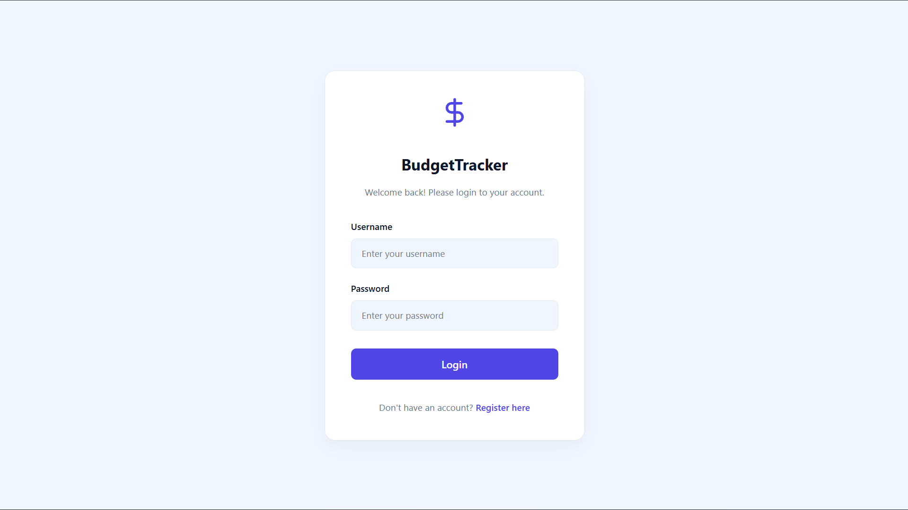
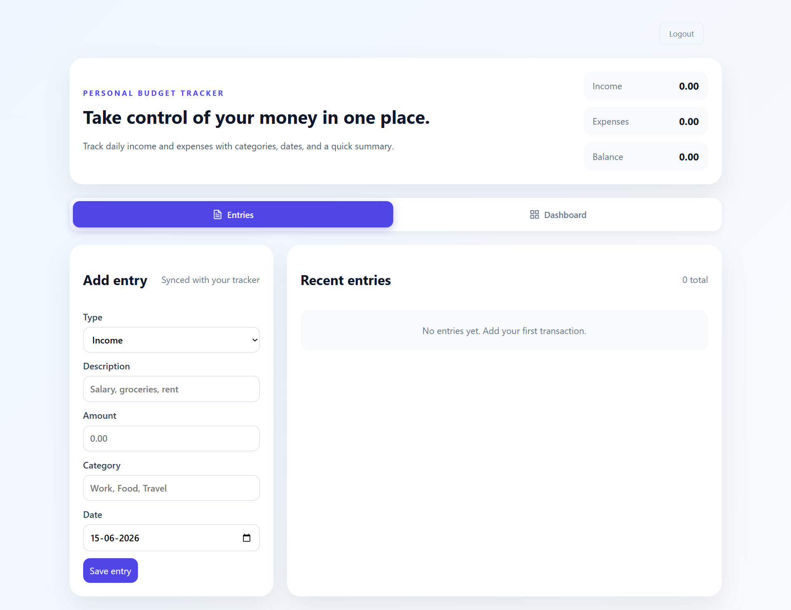
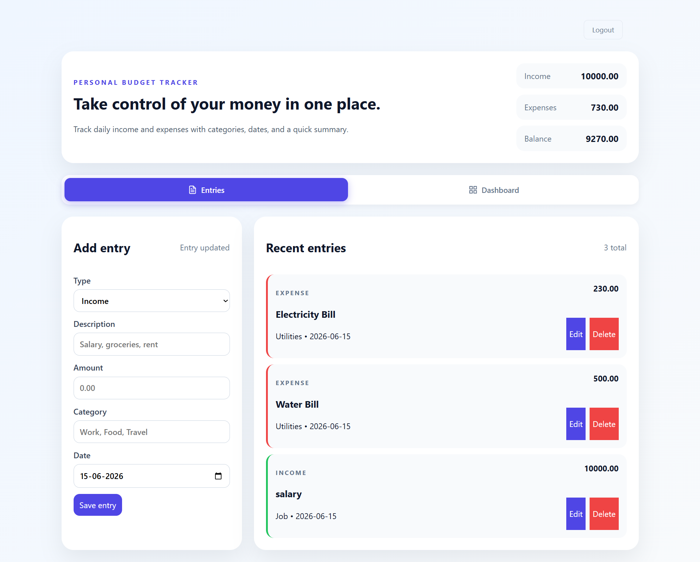
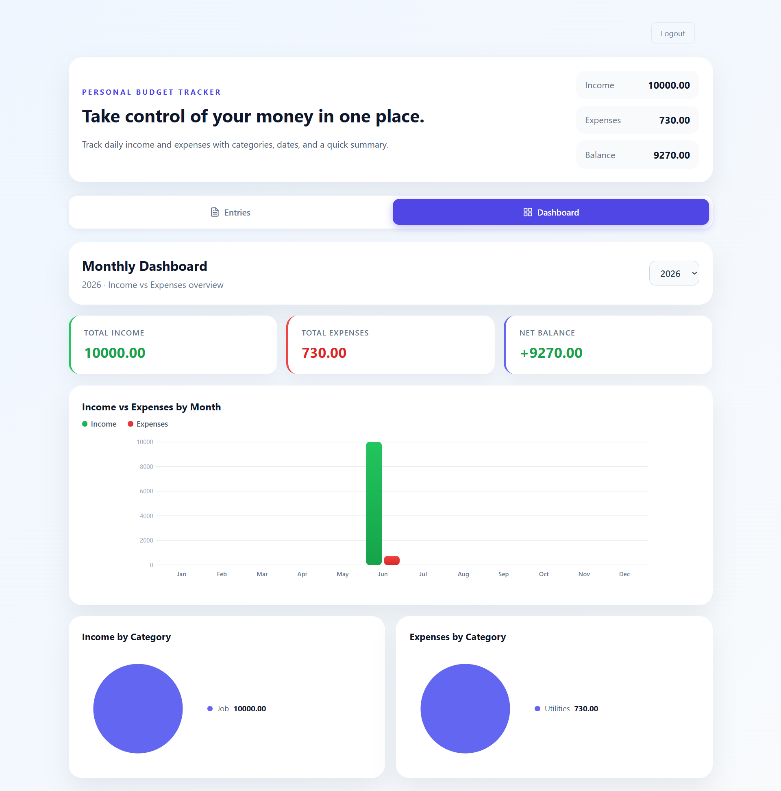
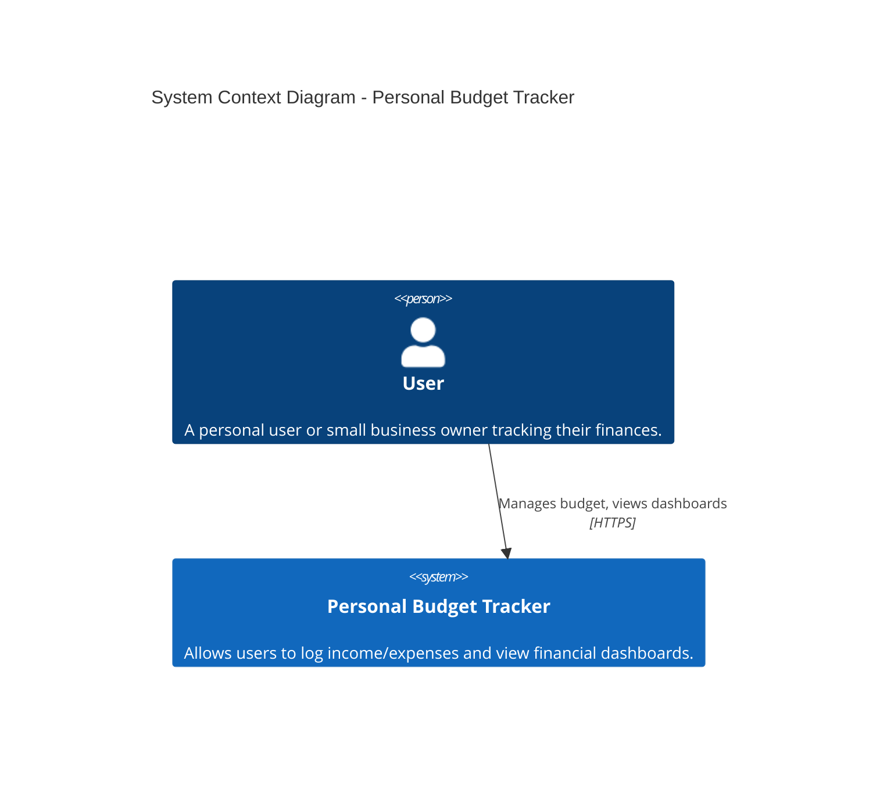
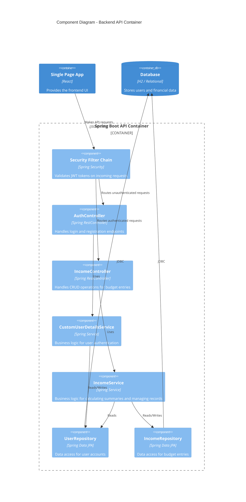
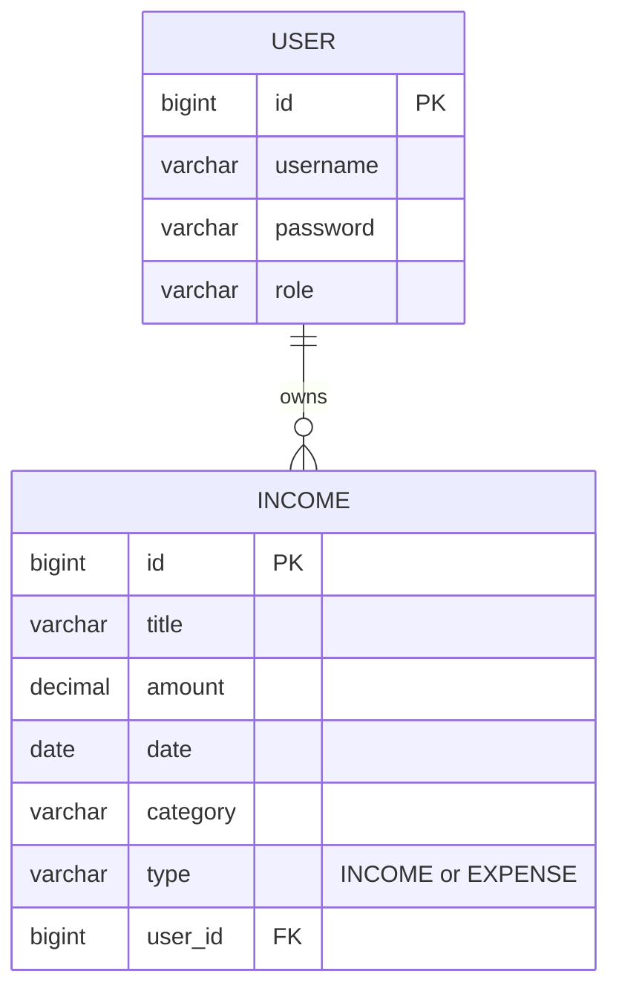
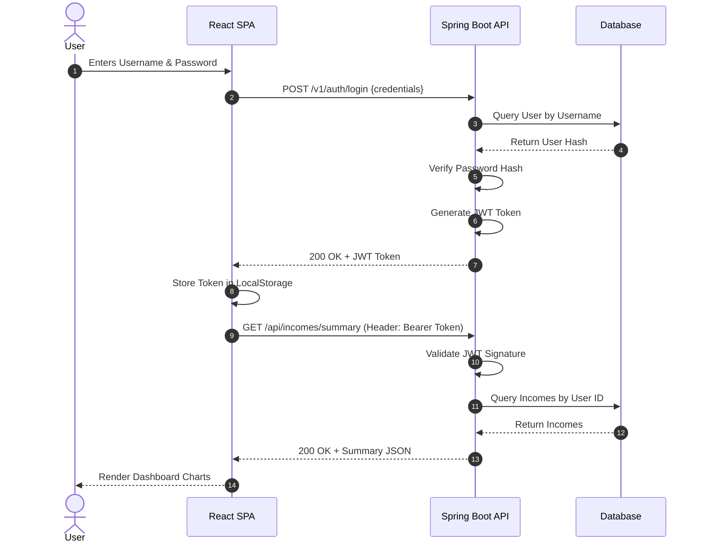
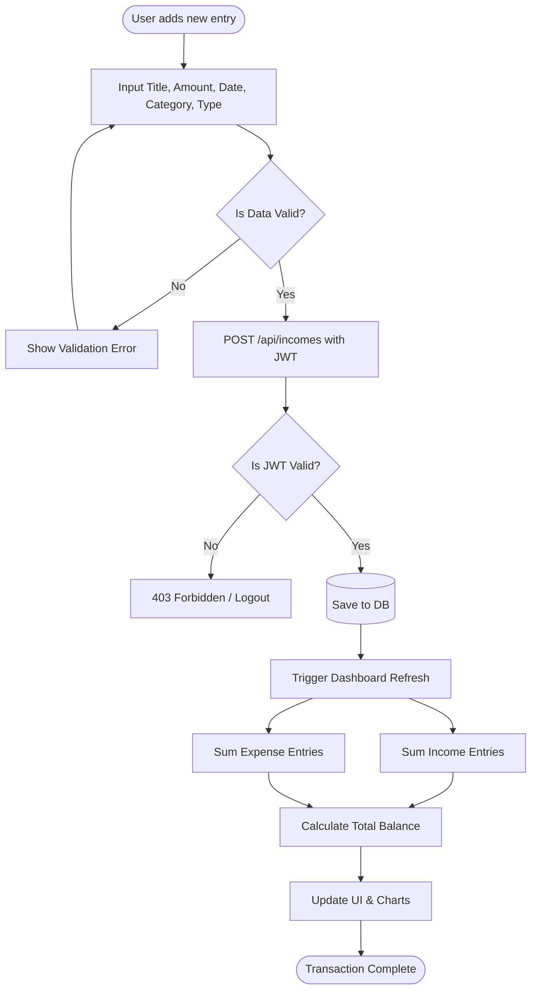

# Personal Budget Tracker


> A modern, full-stack application to track daily income and expenses effortlessly.

## Table of Contents
- [Project Overview](#project-overview)
- [Architecture Overview](#architecture-overview)
  - [System Context Diagram (C4 Level 1)](#diagram-1--system-context-diagram-c4-level-1)
  - [Component Diagram (C4 Level 3)](#diagram-3--component-diagram-c4-level-3)
  - [Entity-Relationship Diagram (ERD)](#diagram-4--entity-relationship-diagram-erd)
  - [Sequence Diagram](#diagram-5--sequence-diagram)
  - [Flowchart (Business Logic Flow)](#diagram-6--flowchart-business-logic-flow)
- [Getting Started](#getting-started)
  - [Prerequisites](#prerequisites)
  - [Installation](#installation)
- [Environment Variables](#environment-variables)
- [Testing](#testing)
- [License](#license)

## Project Overview
Small businesses and individuals often struggle to track their daily income and expenses in one cohesive place. Spreadsheets are clunky and existing apps are too complex for basic use. The Personal Budget Tracker is designed to provide a straightforward, elegant interface for managing financial health. 

**Key Features:**
- 🔐 Secure JWT-based User Authentication
- 💵 Add, edit, and delete income/expense entries
- 📅 Filter and view entries by date
- 📊 Dynamic dashboard displaying a monthly summary with interactive charts
- ⚡ Lightning-fast React + Vite frontend UI
- ☕ Robust Spring Boot backend

### Screenshots
Here is a look at the Personal Budget Tracker in action:

**Login Screen**


**Empty Dashboard**


**Dashboard with Entries**


**Monthly Charts & Analytics**


## Architecture Overview
The system follows a standard modern full-stack web architecture. The React frontend is deployed independently to Vercel and communicates via RESTful APIs to the Spring Boot backend. The backend manages stateless authentication using JSON Web Tokens (JWT) and stores all user and financial records securely. In development, it uses an in-memory H2 relational database, while in production it runs inside a Docker container utilizing a MySQL database. 

### DIAGRAM 1 — System Context Diagram (C4 Level 1)
This diagram illustrates the high-level system context, showing how the primary actor (the User) interacts with the Personal Budget Tracker system, and how the system is conceptually self-contained, handling all business logic and data persistence internally without third-party external service dependencies.



### DIAGRAM 3 — Component Diagram (C4 Level 3)
This diagram breaks down the internal components of the Spring Boot API container. It shows how HTTP requests arrive at the Controllers, are validated and passed to the Service layer for business logic execution, and finally interact with the Data Access Layer (Spring Data JPA Repositories) to read/write to the database. It also highlights the Security Filter Chain validating JWT tokens.



### DIAGRAM 4 — Entity-Relationship Diagram (ERD)
This diagram maps out the database schema, detailing the relationships between the entities in the system. The database is streamlined: a `User` can have multiple `Income` (which represents both income and expense) entries. The relationship is a one-to-many from User to Income.



### DIAGRAM 5 — Sequence Diagram
This diagram outlines the end-to-end flow for user login and subsequent protected API calls. It details how the React frontend submits credentials, how the backend validates them and signs a JWT, and how that JWT is then utilized in the Authorization header to retrieve secured dashboard data.



### DIAGRAM 6 — Flowchart (Business Logic Flow)
This diagram illustrates the decision logic for adding a new financial entry and calculating the monthly summary. It demonstrates the flow of validating an entry type, inserting it into the database, and updating the dynamic dashboard components.



## Getting Started

### Prerequisites
- **Node.js** (v18 or higher)
- **Java** (JDK 17 or higher)
- **Maven** (v3.8+)

### Installation

1. **Clone the repository:**
   ```bash
   git clone https://github.com/azentrix/personal-budget-tracker.git
   cd personal-budget-tracker
   ```

2. **Start the Backend:**
   Navigate to the backend directory and run the Spring Boot app.
   ```bash
   cd personal-budget-tracker
   mvn spring-boot:run
   ```
   *The backend will start on `http://localhost:8080`.*

3. **Start the Frontend:**
   Open a new terminal, navigate to the frontend directory, install dependencies, and start the Vite dev server.
   ```bash
   cd personal-budget-trackerf
   npm install
   npm run dev
   ```
   *The frontend will be accessible at `http://localhost:5173`.*

## Environment Variables & Profiles
The application uses Spring Profiles to seamlessly switch between local development and production environments.

### Local Profile (`application-local.properties`)
By default, the application runs with the `local` profile, which provisions a lightweight, in-memory H2 database.
```properties
spring.datasource.url=jdbc:h2:mem:budgetdb;MODE=MySQL...
spring.h2.console.enabled=true
```

### Production Profile (`application-prod.properties`)
When the backend is deployed via Docker, the container activates the `prod` profile (`SPRING_PROFILES_ACTIVE=prod`), which connects to the bundled MySQL database. The frontend is hosted separately on Vercel and securely communicates with the backend APIs via configured CORS origins.
```properties
spring.datasource.url=jdbc:mysql://localhost:3306/${MYSQL_DATABASE}...
spring.datasource.driver-class-name=com.mysql.cj.jdbc.Driver
spring.datasource.username=root
spring.jpa.hibernate.ddl-auto=update
```

Ensure the core JWT properties in `application.properties` remain secure:
jwt.secret=dGhpc0lzQVZlcnlTZWN1cmVTZWNyZXRLZXlGb3JKV1RUb2tlbkdlbmVyYXRpb24xMjM0NTY3ODk=
jwt.expiration=86400000
```

## Testing
To run the automated test suites for the backend:

```bash
cd personal-budget-tracker
mvn test
```

## License
MIT © 2026.
